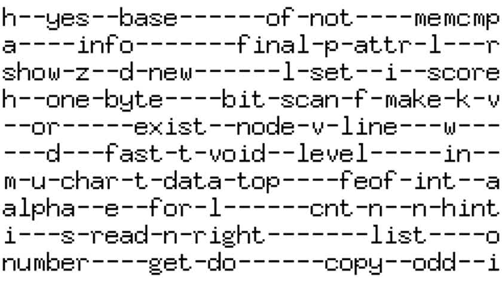

# jigsaw

Create crossword puzzles (Winner of the 1996 spring POTM, Crozzle).

### Welcome to the Wonderful World of width-first tree searches

Jigsaw will try to link together as many words as possible from the wordlist in "crossword-puzzle" fashion.
It was the winner of the 1996 spring POTM (Programmer Of The Month) contest.

## Usage

```
usage: jigsaw [<wordlist>]
        -h      help
        -s      symmetrical
        -t int  TIMEMAX
        -n int  NODEMAX

Load words from <wordlist> or stdin if not specified.

  -h
      Show this text and default values
  -s
      Create a horizontal/vertical symmetrical crossword
  -t int
      Maximum cpu time in seconds
  -n int
      Maximum number of nodes per round
```

## Manifest

 - [DESCRIPTION.txt](DESCRIPTION.txt)  
   Problem description.

 - [APPROACH.txt](APPROACH.txt)  
   Annotation and background of the entry.

 - [jigsaw.c](jigsaw.c)  
   The program.

 - [worldnet.list](worldnet.list)  
   Wordlist. A promotional page for AT&T's new internet service called "Worldnet".

 - [plato.list](plato.list)  
   Wordlist. One of the dialogues of Plato: Timaeus. This particular dialogue contains the first known reference to the lost continent of Atlantis.

 - [german.list](german.list)  
   Wordlist. a list of mathematical resources on the web ... mostly in German (which I sought out for it's tendancy to long words).

 - [jigsaw.list](jigsaw.list)  
   Wordlist. a list of coding words to generate the project preview.

## Project teaser

The project teaser was created af ter applying the following patch:

```C
        #define GRIDXMAX (34+2)  // Size of grid incl. border
        #define GRIDYMAX (10+2)  // Size of grid incl. border
```

The following command takes about 45 minutes to complete:

```sh
        ./jigsaw <jigsaw.list -d -D -t 9999 -n 100000 -s
```

## Known bugs

- Grid size is hardcoded to 20x20
- Words are alphabetic/lowercase only

## Source code

Grab one of the tarballs at [https://github.com/xyzzy/jigsaw/releases](https://github.com/xyzzy/jigsaw/releases) or checkout the latest code:

```sh
        git clone https://github.com/xyzzy/jigsaw.git
```

## Versioning

This project adheres to [Semantic Versioning](http://semver.org/spec/v2.0.0.html).
For the versions available, see the [tags on this repository](https://github.com/xyzzy/jigsaw/tags).

## License

This project is licensed under GPLv2 - see the [LICENSE.txt](LICENSE.txt) file for details.
